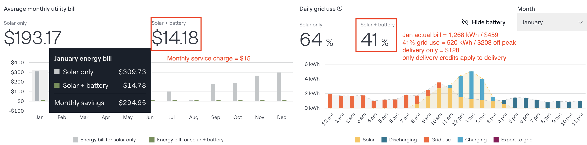
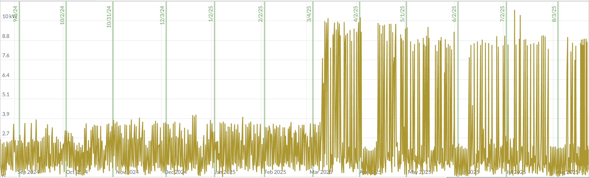
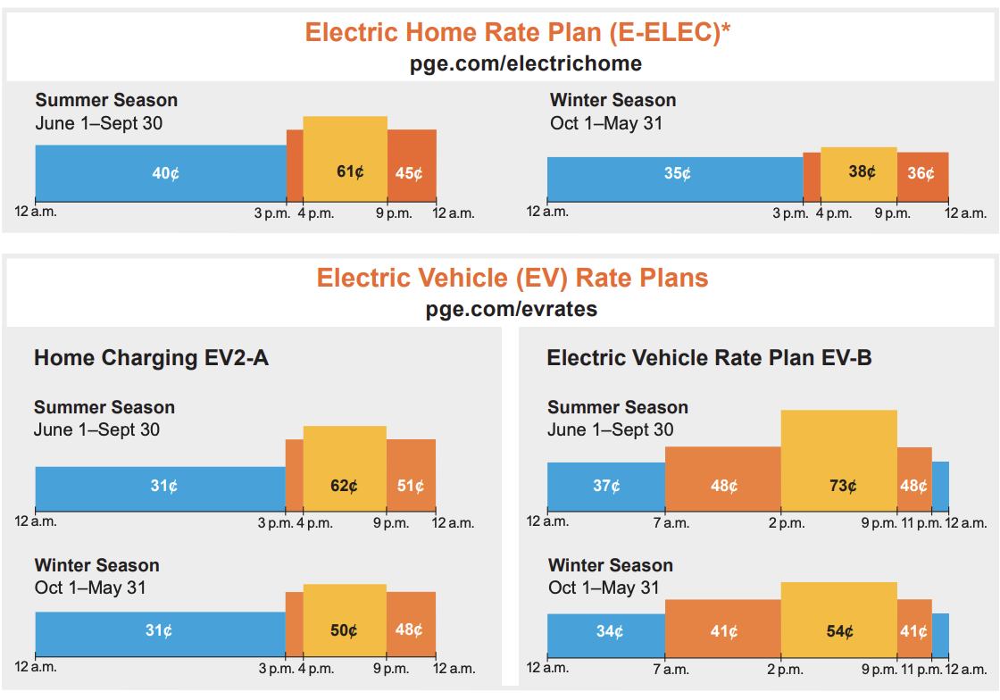
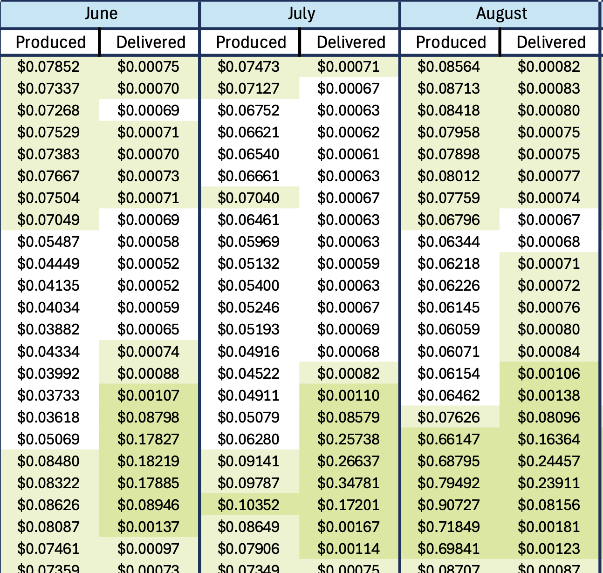
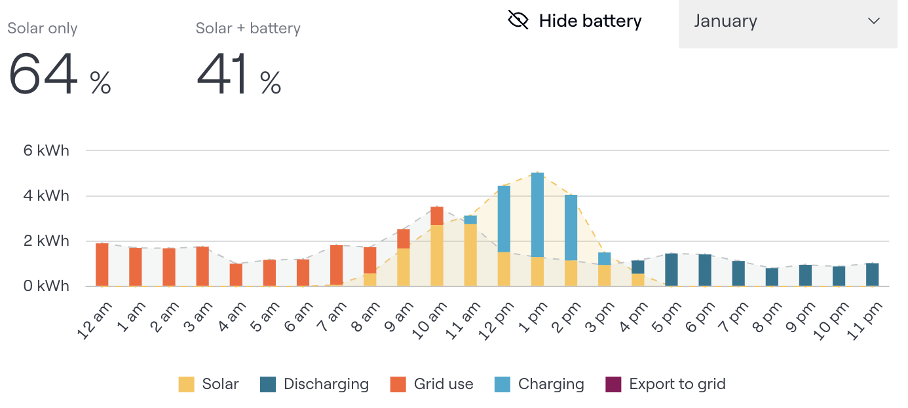
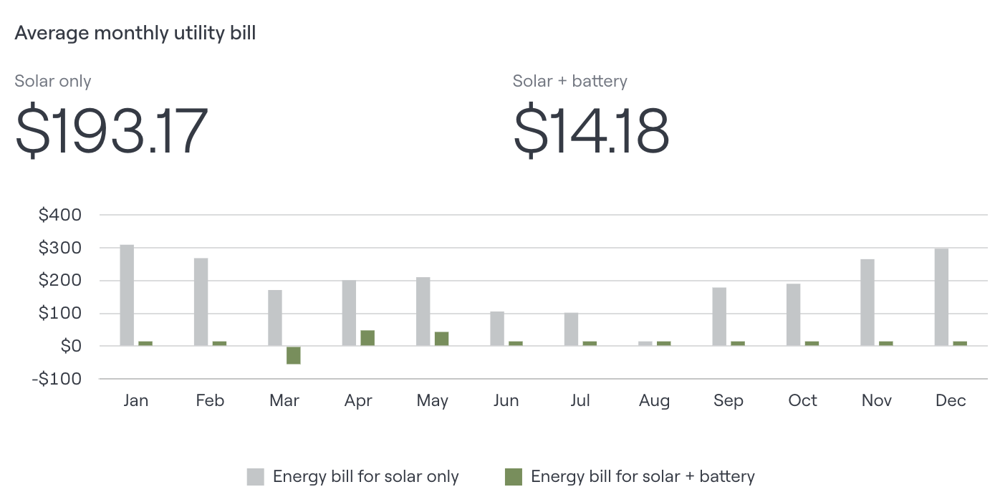

# Solar sizing

## solar company quote

The quote from the solar company makes big claims,
does not explain their methodology,
and has some inconsistencies.

## setup

Get 1 year of hourly interval data from PG&E.

Added EV charging in March 2025.

Copy 12-3am charging data to

  - May -> Jan, Mar, Jun,Oct, Nov, Dec (winter)
  - Apr -> Feb, Nov (winter)
  - Jun -> Sep (summer)
  - Jul -> Aug (summer)

Then swap 12-3am / 12-3pm to do EV charging when solar is available.

## solar output estimate

Get solar output estimates from [https://www.renewables.ninja](https://www.renewables.ninja/about)

> Renewables.ninja allows you to run simulations of the hourly power output from wind and solar power plants located anywhere in the world. We have built this tool to help make scientific-quality weather and energy data available to a wider community.

  - 10 kW system size
  - San Jose, CA
  - 16,962 annual kWh
  - higher than solar company estimate: 16,680 kWh for 10.44 kW system

### solar production is sometimes variable

- Dec, Jan, Feb don't have enough generation available to cover demand: shorter day, more cloudy days
- Jul, Aug, Sep have ideal curves: no clouds
- average is not useful outside of summer

In January, only 7 days have enough solar to match demand.

April usually has more solar than demand, plus sometimes 2/3 of the battery capacity.

In July, every day can meet demand and then fill 2/3 of the battery.

## daily usage pattern

- 33 kWh  off peak
- 4 kWh part peak
- 6 kWh peak

10 kWh part peak + peak

76% usage and 65% of cost is off peak.

| period | use % | cost % | cost $ |
|--------|-------:|--------:|--------:|
| summer off peak | 21% | 18% | 1,825 |
| summer part peak | 2% | 3% | 324 |
| summer peak | 4% | 6% | 607 |
| winter off peak | 55% | 47% | 4,726 |
| winter part peak | 7% | 10% | 984 |
| winter peak | 10% | 16% | 1,654 |

### grid costs

## methodology

Label TOU periods according to tariff rules:

  - 3-4pm 9pm-12am part peak
  - 4-9pm peak
  - 12am-3pm off peak

Load hourly solar output model.

Create flow model for each period

  - timestamp
  - demand
  - start_battery_level
  - end_battery_level
  - solar_generation
  - from_solar
  - from_battery
  - from_grid
  - to_battery
  - to_grid

In winter, use battery in off peak if it's at least this level;
might need all daily solar production to offset peak usage

`MIN_BATTERY_WINTER = PEAK_USAGE`

In summer, let battery go lower since it will likely refill.

`MIN_BATTERY_SUMMER = PEAK_USAGE / 4`

### flow model

| all periods |
|----------------------|
| Use all available solar generation for demand (from_solar). |

| **peak and part peak** | **off peak** |
|---------------------|--------------|
| Use all available battery (from_battery) | Draw from battery, maintaining minimum battery level (from_battery) |
| Draw from grid (from_grid) | Draw from grid (from_grid) |
| If excess (solar_generation > from_solar), charge battery to capacity (to_battery) | If fill off peak and last off peak hour, fill battery from grid (to_battery, from_grid) |

| all periods |
|----------------------|
| Export remainder (to_grid).|

## calculate costs

rate = per-kWh cost from period and tariff

credit is variable, but is lower than off peak grid rates (ELEC: 0.40) for 98% of hours.

source: [2025 EEC price sheet](presentation/PGE_EEC_Price_Sheet_2025.pdf)

- pge cost = demand * rate
- pge credit = to_grid * credit
- grid cost = from_grid * rate
- net cost = grid cost + pge credit
- savings = pge cost - net cost

## observations

### hourly averages are misleading

Quote: "most typical day of the selected month"

A run of cloudy weather will drain the battery.

### cost estimates are very different

### variable patterns

EV charging can increase daily use by 50%, but is not every day.

Solar output may be low for days at a time, and the battery can drop to 0.

Usually in winter (Dec-Feb), there's not enough solar available to cover demand.
But even in January, a 30 kWh battery sometimes fills, creating exports.

How often do we want to change settings? March is variable but less so than January.
There are sometimes high credit hours, but it's unclear how configurable the [Franklin WH System](https://sunwatts.com/content/manual/franklin_System_User_Manual.pdf) is:

> the homeowner can select the Time of Use mode to customize the on-peak and
off-peak times according to the electricity rate. The FranklinWH system will select  solar and aPower battery power during peak rate periods. During the off-peak periods, the system will use power from the grid, the PV system, and the batteries in balance according to household loads.

> users may set a time plan for economic power usage through the FranklinWH App. One or two time periods may be set for every 24 hours

## sizing scenarios

### 10 kW panels and 30 kWh battery capacity

Sum from_solar, from_battery, from_grid, to_grid for all periods in a month:

- July and August are solar+battery only; June and September almost are
- Some export in all but December: runs of sun overfill the battery but runs of cloud require grid.

#### January
Solar is variable, usually not enough to cover demand, but a
sunny week creates exports. The battery if often near empty.

#### April
Solar is more reliable, mostly covering demand.
April includes a week of vacation.

#### July
Consistently sunny conditions keep the battery overflowing.

### more battery: 10 kW panels and 45 kWh battery capacity

Any solar generated when the battery is full is a waste: the ~0.04/kWh
credit is 10% of off peak use, and 5-6% of peak use.
With more storage capacity, we could replace $0.31-0.62 grid use. But batteries are expensive: $14k for 15 kWh capacity unit ($910/kWh).

Much reduced export in winter months, but still signifcant exports in summer.
Is this worth the battery cost?

### fewer panels: 8 kW panels and 30 kWh battery capacity

Reduce generation to reduce grid export waste.

Reduced exports vs both base and more battery. Fewer
panels cost less. Summer months show small grid use, but also export.
How can these be better matched? 

## cost

|  | solar % | year 1 savings | payback period | IRR (15 years) |
|:---------|---------:|----------------:|----------------:|-----:|
| 8 kW solar, 30 kWh battery	| 67% |	4,157 |	7.9 |	0.91%
| 10 kW solar, 30 kWh battery	| 74% |	4,444 |	8.5 |	0.79%
| 10 kW solar, 45 kWh battery	| 78% |	4,670 |	10.2 |	0.52%

## other considerations

  - rate value forecast?
  - reduced grid dependence
  - really is solar power (see [How clean is your clean power?](https://gridium.com/how-clean-is-your-clean-power/))
  - backup
  - change in use patterns (induction stove, heat pump A/C, 2nd EV)