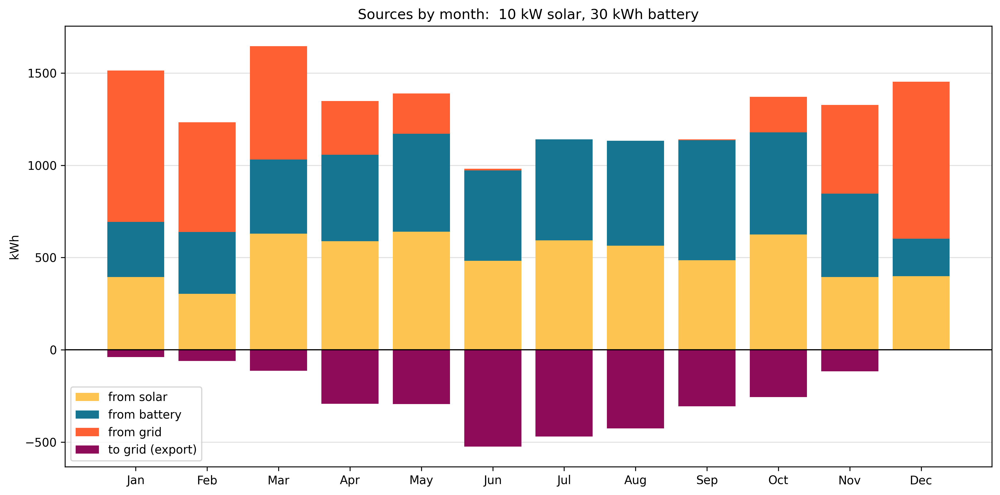
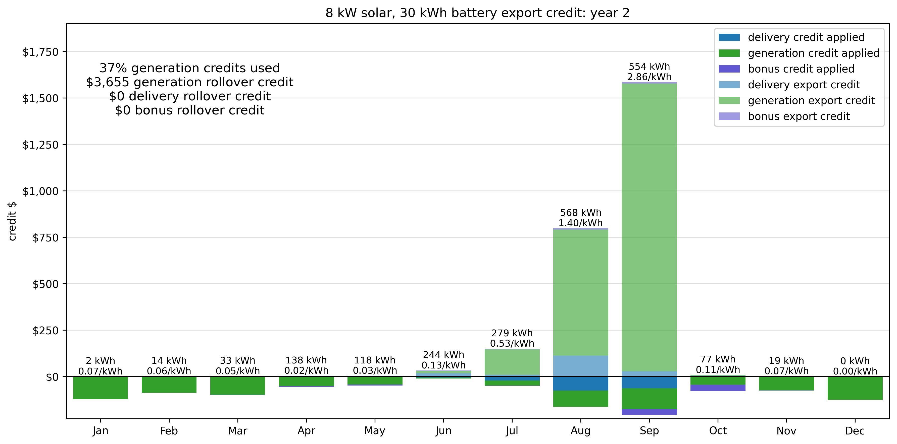
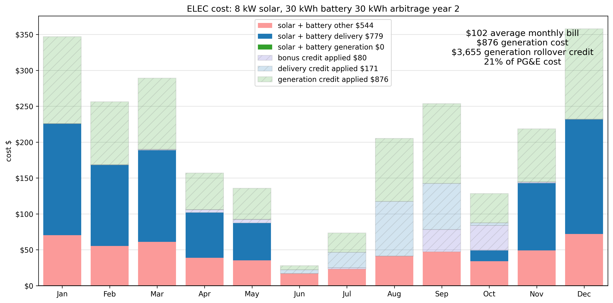
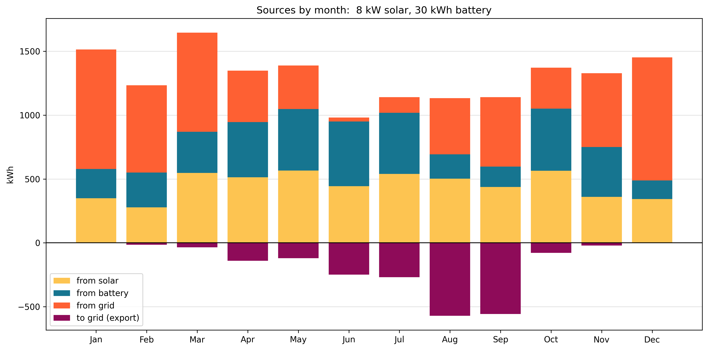
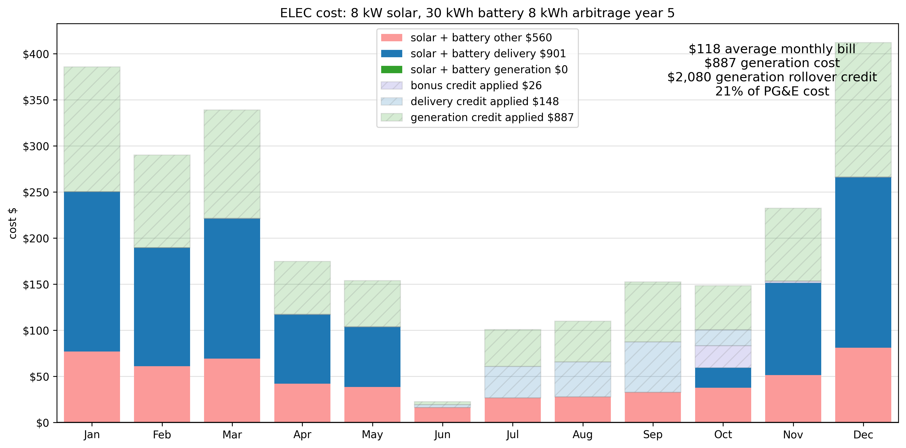
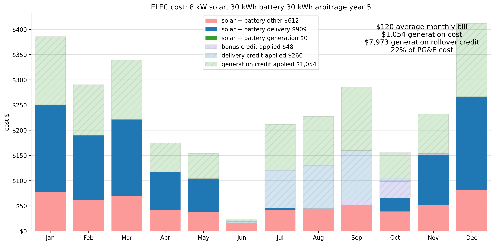

# Solar sizing

A quote from a solar installation company makes big claims,
does not explain their methodology,
and and is internally inconsistent.

Using my electricity, a solar output model from , and PG&E documents on tariff rates and credits,
I created a Python model to understand and visualize flows and costs with a solar + battery
system. The solar company estimate seems to be incorrectly calculating bills (likely export credits),
producing a wildly optimistic rate of return. Also, modeling this accurately is much harder than
I expected!

See [brown bag presentation](presentation/Solar%20system%20planning.pdf) on methodology
and results.

## Setup

Get 1 year of hourly interval data from PG&E.

Added EV charging in March 2025.

Copy 12-3am charging data to

  - May -> Jan, Mar, Jun,Oct, Nov, Dec (winter)
  - Apr -> Feb, Nov (winter)
  - Jun -> Sep (summer)
  - Jul -> Aug (summer)

Then swap 12-3am / 12-3pm to do EV charging when solar is available.

## Solar output estimate

Get solar output estimates from [Renewables.ninja](https://www.renewables.ninja/): 
  - Solar photovoltaic power (PV) (Point API) at coordinates (37.336, -121.891)
  - Version: 1.4 (gsee f9b6961).  
  - License: [Creative Commons Attribution-NonCommercial 4.0 International (CC BY-NC 4.0)](https://creativecommons.org/licenses/by-nc/4.0/)  
  - Reference: S. Pfenninger and I. Staffell, *Long-term patterns of European PV output using 30 years of validated hourly reanalysis and satellite data*, Energy (2016), [https://doi.org/10.1016/j.energy.2016.08.060](https://doi.org/10.1016/j.energy.2016.08.060)

> Renewables.ninja allows you to run simulations of the hourly power output from wind and solar power plants located anywhere in the world. We have built this tool to help make scientific-quality weather and energy data available to a wider community.

  - 10 kW system size
  - San Jose, CA
  - 16,962 annual kWh
  - higher than solar company estimate: 16,680 kWh for 10.44 kW system

### Solar production is sometimes variable

- Dec, Jan, Feb don't have enough generation available to cover demand: shorter day, more cloudy days
- Jul, Aug, Sep have ideal curves: no clouds
- average is not useful outside of summer

In January, only 7 days have enough solar to match demand.

April usually has more solar than demand, plus sometimes 2/3 of the battery capacity.

In July, every day can meet demand and then fill 2/3 of the battery.

## Daily usage pattern

- 33 kWh  off peak
- 4 kWh part peak
- 6 kWh peak

10 kWh part peak + peak

76% usage and 65% of cost is off peak.

| period | use % | cost % | cost $ |
|--------|-------:|--------:|--------:|
| summer off peak | 21% | 18% | 1,825 |
| summer part peak | 2% | 3% | 324 |
| summer peak | 4% | 6% | 607 |
| winter off peak | 55% | 47% | 4,726 |
| winter part peak | 7% | 10% | 984 |
| winter peak | 10% | 16% | 1,654 |

### Grid costs

## methodology

Label TOU periods according to tariff rules:

  - 3-4pm 9pm-12am part peak
  - 4-9pm peak
  - 12am-3pm off peak

Load hourly solar output model.

Create flow model for each period

  - timestamp
  - demand
  - start_battery_level
  - end_battery_level
  - solar_generation
  - from_solar
  - from_battery
  - from_grid
  - to_battery
  - to_grid

In winter, use battery in off peak if it's at least `min_battery_winter` (default 10)
might need all daily solar production to offset peak usage

In summer, let battery go lower since it will likely refill: `min_battery_summer` (default 2.5)

### Flow model

| all periods |
|----------------------|
| Use all available solar generation for demand (from_solar). |

| **peak and part peak** | **off peak** |
|---------------------|--------------|
| Use all available battery (from_battery) | Draw from battery, maintaining minimum battery level (from_battery) |
| Draw from grid (from_grid) | Draw from grid (from_grid) |
| If excess (solar_generation > from_solar), charge battery to capacity (to_battery) | If fill off peak and last off peak hour, fill battery from grid (to_battery, from_grid) |

| all periods |
|----------------------|
| Export remainder (to_grid).|

## Calculate costs

rate = per-kWh cost from period and tariff

credit is variable, but is lower than off peak grid rates (ELEC: 0.40) for 98% of hours.

source : [2025 EEC price sheet](presentation/PGE_EEC_Price_Sheet_2025.pdf)

- pge cost = demand * rate
- pge credit = to_grid * credit
- grid cost = from_grid * rate
- net cost = grid cost + pge credit
- savings = pge cost - net cost

## Observations

### Hourly averages are misleading

Quote: "most typical day of the selected month"

A run of cloudy weather will drain the battery.

### Export credits from summer do not offset winter use

Export credits are based on value to grid. Highest value is during peak periods / lower solar production. Weekend rates are sometimes 0 but rates do not vary by weekday/weekend.

Delivery credits offset delivery charges (⅔ of bill); generation credits offset generation charges. 

Credits do not apply to other charges (5.7¢/kWh) or monthly service charge ($15).

Average credit is 4-5¢/kWh: 11% of off peak rate. Sell 1 kWh for 4¢ in July, buy for 35¢ in January.

### Cost estimates are very different

### Variable patterns

EV charging can increase daily use by 50%, but is not every day.

Solar output may be low for days at a time, and the battery can drop to 0.

Usually in winter (Dec-Feb), there's not enough solar available to cover demand.
But even in January, a 30 kWh battery sometimes fills, creating exports.

How often do we want to change settings? March is variable but less so than January.
There are sometimes high credit hours, but it's unclear how configurable the [Franklin WH System](https://sunwatts.com/content/manual/franklin_System_User_Manual.pdf) is:

> the homeowner can select the Time of Use mode to customize the on-peak and
off-peak times according to the electricity rate. The FranklinWH system will select  solar and aPower battery power during peak rate periods. During the off-peak periods, the system will use power from the grid, the PV system, and the batteries in balance according to household loads.

> users may set a time plan for economic power usage through the FranklinWH App. One or two time periods may be set for every 24 hours

## Sizing scenarios

### 10 kW panels and 30 kWh battery capacity

Sum `from_solar`, `from_battery`, `from_grid`, `to_grid` for all periods in a month:

- July and August are solar+battery only; June and September almost are
- Some export in all but December: runs of sun overfill the battery but runs of cloud require grid.

#### January
Solar is variable, usually not enough to cover demand, but a sunny week creates exports. 
The battery if often near empty.

#### April
Solar is more reliable, mostly covering demand.

#### July
Consistently sunny conditions keep the battery overflowing.

### More battery: 10 kW panels and 45 kWh battery capacity

Any solar generated when the battery is full is a waste: the ~0.04/kWh
credit is 10% of off peak use, and 5-6% of peak use.
With more storage capacity, we could replace $0.31-0.62 grid use. But batteries are expensive: $14k for 15 kWh capacity unit ($910/kWh).

Much reduced export in winter months, but still signifcant exports in summer.
Is this worth the battery cost?

### Fewer panels: 8 kW panels and 30 kWh battery capacity

Reduce generation to reduce grid export waste.

Reduced exports vs both base and more battery. Fewer
panels cost less. Summer months show small grid use, but also export.
How can these be better matched? 

### Arbitrage opportunities
PG&E 20 year schedule has a few hours with much higher than usual export rates.

#### Arbitrage model: days with export value > peak

| Before max daily export hour |
|----------------------|
| Use all available solar generation to charge battery (to_battery) |
| If battery at capacity, use remaining solar for demand (from_solar) |
| Draw from grid to meet remaining demand (from_grid) |

| Max daily export hour(s)* max battery discharge is 10 kW; may need 2 hours |
|----------------------|
| Export from battery (from_battery, to_grid) |
| Draw from grid for demand (from_grid) |

| After daily export hour |
|----------------------|
| Draw from grid: no solar output, empty battery (from_grid) |

Generates massive generation credits!

But:
  - only apply to generation (⅓ of bill)
  - grid use instead of battery 7pm-morning; peak/part peak until midnight
  - delivery credits mostly used up replacing what could’ve been battery
  - non-bypassable costs (5.7¢/kWh) on additional grid use add up

Generation costs go to 0, but delivery + other costs for winter months still significant.

Cost is lower: it works. But not as much value as high export values might indicate.

| Sep ‘26 | Credit | Future peak use |
|---------|--------|------------------|
| Generation | $2.52, $2.31 | 7.7 hr | 
| Delivery | $0.067, $0.069 | 0.3 hr | 

Not 100% solar in summer months.

Delivery credits don’t fully offset future use.

Credits roll over, but decrease in value as rates increase.

Testing 30, 20, 10, 8, 6 kWh exports shows exporting 8 kWh during super peak export
credit hours balances high credits with additional grid use.

PG&E: “There is no financial benefit to installing a system larger than your home needs.”

## Cost

| description | payback period | IRR (15 years) | solar use |
|:---------|---------:|----------------:|----------------:|
| 10 kW solar, 45 kWh battery | 11.7 |	0.52%	| 78% |
| 10 kW solar, 30 kWh battery	| 9.8 |	0.81% |	74% |
| 8 kW solar, 30 kWh battery | 9.6 |	0.86% |	67% |
| 8 kW solar, 30 kWh battery, 8 kWh arbitrage |	8.6 |	1.03% |	65% |
| 8 kW solar, 30 kWh battery, 8% rate increase | 8.8 |	1.15% |	67% |

  - Best savings with larger PG&E rate increases
  - Battery is too expensive.
  - 10 kW catches up eventually but it takes a long time.
  - Arbitrage generates massive credits. But generation credits can’t be fully used; also requires more grid use.

With: high electricity costs, high solar output, 30% install cost credit: it's not a
good investment on $ terms.

But

  - ROI is not the right metric; this project is more like a kitchen remodel
  - Reduced grid dependence is a goal
  - Power really is solar power (see [How clean is your clean power?](https://gridium.com/how-clean-is-your-clean-power/))
  - Battery backup for power outages (but maintaining reserve requires grid use)

### Variables and unknowns

  - Solar model accuracy, future weather patterns
  - Change in use patterns
  - Rate change forecast
    - used 4% to match quote
    - 10 year median = 5%
    - average = 8% (> 10% 2022-2024)
  - Maintenance
  -   Linear warranties
  - 15 year ROI period: from battery warranty
    - Solar panel warranty is 25 years product, 30 years performance with 87% output
    - Used -0.04% annual degradation
  - Export credit value: based on value to grid (+ solar company lobbying)
    - after 9 years, credit values updated every two years with current energy prices
  - Solar panel prices
    - -91% last 15 years; -42% last 5 years

# References

  - [PG&E: Residential rate plan pricing](https://www.pge.com/assets/pge/docs/account/rate-plans/residential-electric-rate-plan-pricing.pdf)
  - [PG&E Solar Billing Plan guide](https://www.pge.com/assets/pge/localized/en/docs/clean-energy/solar/pge-solar-billing-plan-guide.pdf)
  - [PG&E export credits](http://www.pge.com/energyexportcredit)
  - [PG&E bonus export credits](https://www.pge.com/assets/pge/docs/save-energy-and-money/energy-savings-programs/solar-billing-plan-marketing-toolkit-en.pdf.coredownload.pdf)
  - [Renewables.ninja hourly solar output model](https://www.renewables.ninja)

