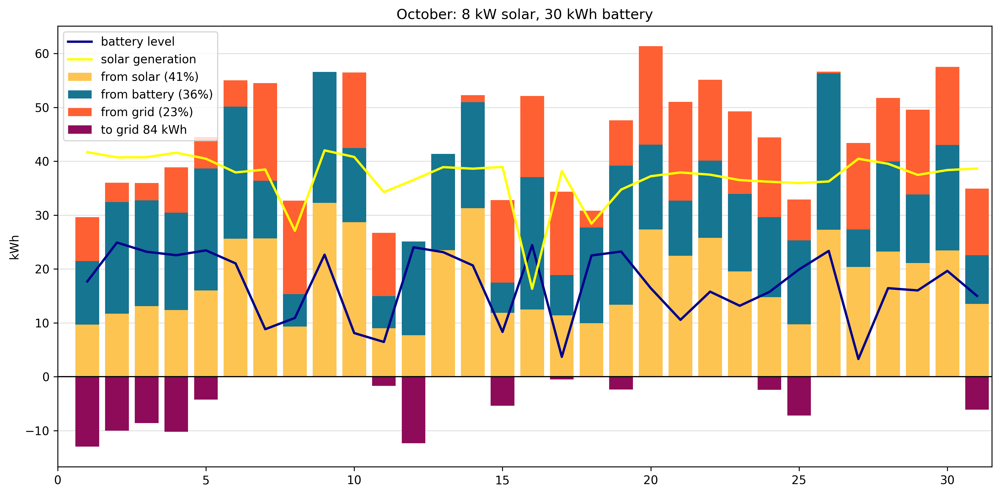

# 8 kW solar, 30 kWh battery, 8 kWh arbitrage

| Parameter | Value |
|--------|-------:|
| Solar panels | 8 kW |
| Battery | 30 kWh |
| Annual rate increase | 4% |
| Min battery: summer | 2 |
| Min battery: winter | 11 |
| System cost | $36,632 |
| Model | arbitrage |
| Arbitrage discharge | 8.0 kWh|
| Demand | 15,667 kWh |
| Tariff | ELEC |

## Overall results: 15 years

|  |  |
|--------|-------:|
| blended cost per kWh | $0.0634 |
| payback period | 8.6 years |
| IRR | 1.03% |

### by month

### January

### July

### October

## Year 2 results

|  |  |
|--------|-------:|
| Grid cost | $5,424 |
| Net cost | $993 | 
| Savings | $4,431 |
| From grid | 4,613 kWh |
| From grid % | 29% |
| To grid | 1,421 kWh |
| Credit per kWh | $1.36 |
| Applied credit per kWh | $0.52 |

### Credits

| Credit type | Applied | Rollover (unused) |
|--------|-------:|-------:|
| Generation | $636 | $1,200 |
| Delivery credit | $97 | $0 |
| Bonus | $55 | $0 |

## Year 5 results

