# 8 kW solar, 30 kWh battery, max arbitrage

| Parameter | Value |
|--------|-------:|
| Solar panels | 8 kW |
| Battery | 30 kWh |
| Annual rate increase | 4% |
| Min battery: summer | 2 |
| Min battery: winter | 11 |
| System cost | $36,632 |
| Model | arbitrage |
| Arbitrage discharge | 30.0 kWh|
| Demand | 15,667 kWh |
| Tariff | ELEC |

## Overall results: 15 years

|  |  |
|--------|-------:|
| blended cost per kWh | $0.0637 |
| payback period | 8.7 years |
| IRR | 1.05% |

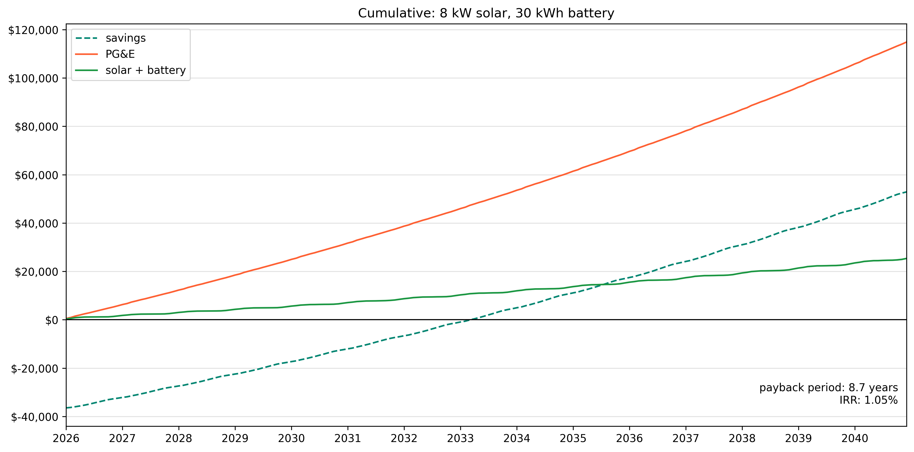

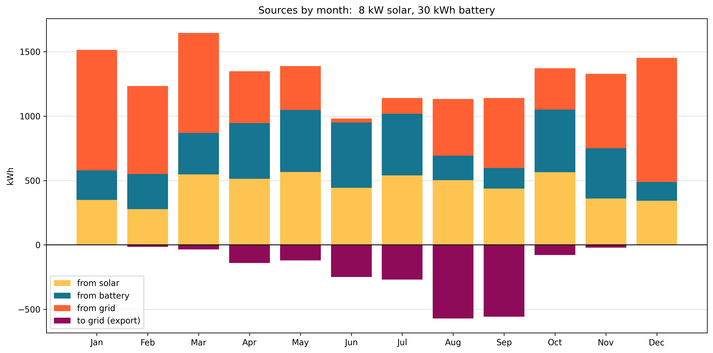

### by month

### January

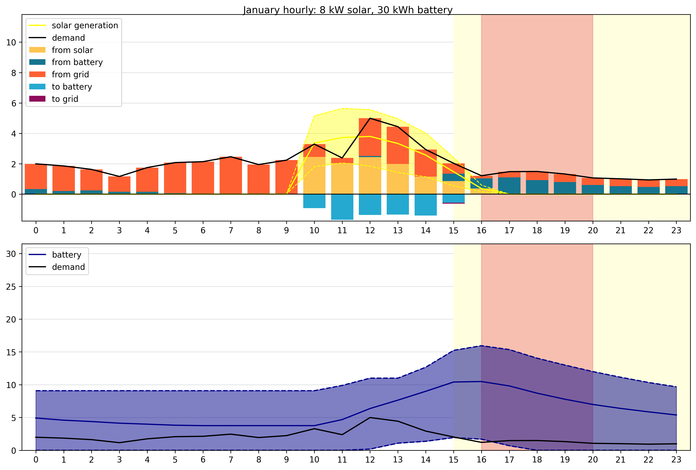

### July
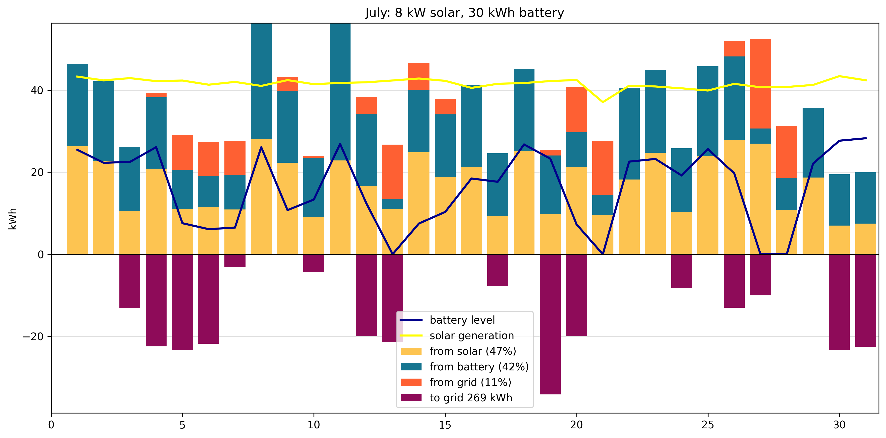

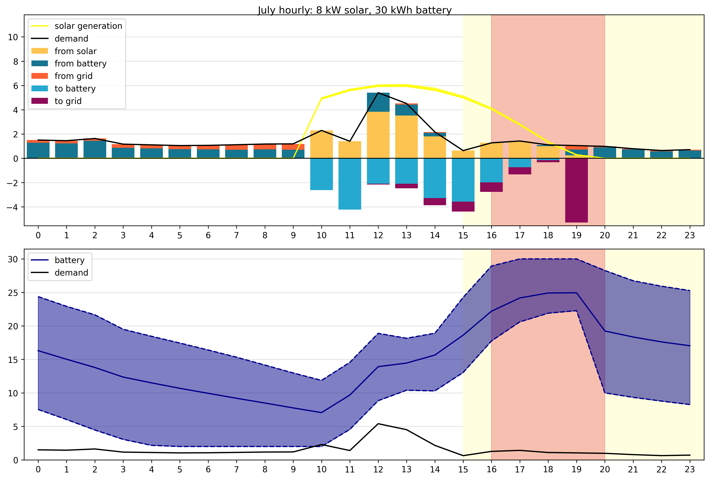

### October

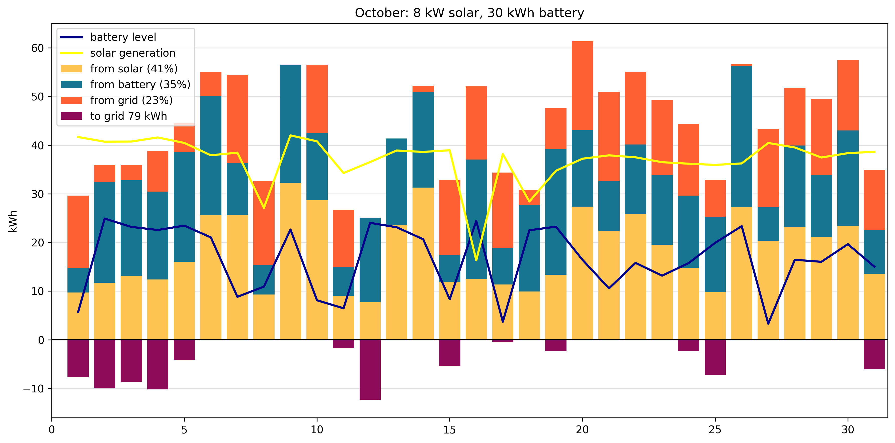

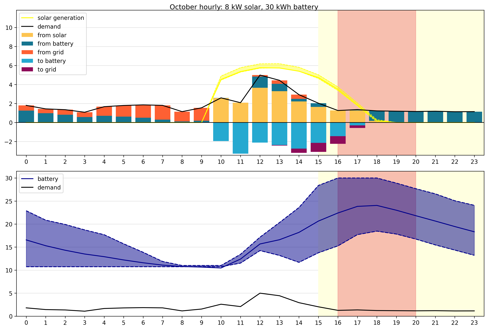

## Year 2 results

|  |  |
|--------|-------:|
| Grid cost | $5,424 |
| Net cost | $998 | 
| Savings | $4,425 |
| From grid | 5,236 kWh |
| From grid % | 33% |
| To grid | 2,045 kWh |
| Credit per kWh | $2.24 |
| Applied credit per kWh | $0.45 |

### Credits

| Credit type | Applied | Rollover (unused) |
|--------|-------:|-------:|
| Generation | $754 | $3,655 |
| Delivery credit | $171 | $0 |
| Bonus | $80 | $0 |

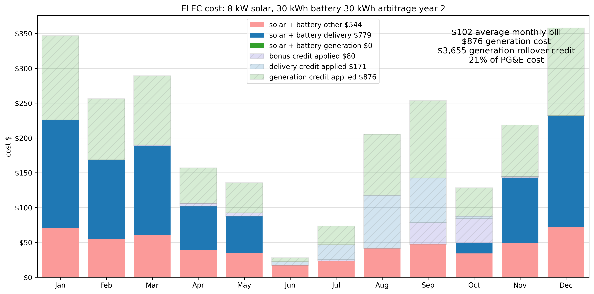

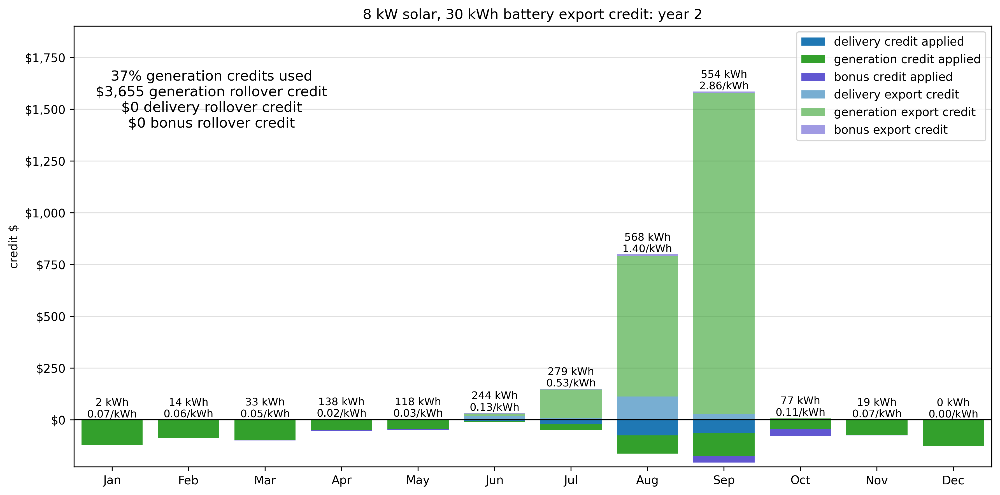

## Year 5 results

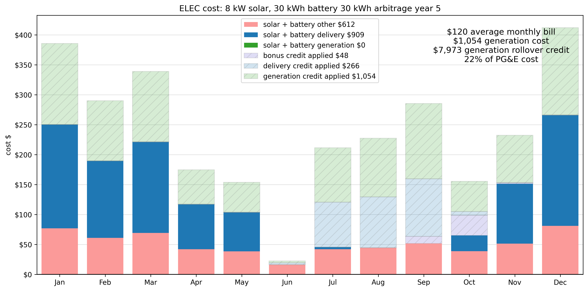

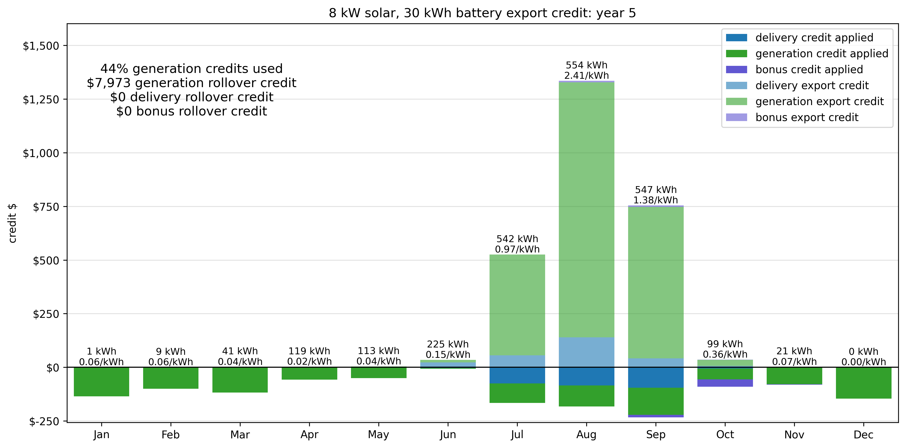