# 8 kW solar, 30 kWh battery, 8% rate increase

| Parameter | Value |
|--------|-------:|
| Solar panels | 8 kW |
| Battery | 30 kWh |
| Annual rate increase | 8% |
| Min battery: summer | 2 |
| Min battery: winter | 11 |
| System cost | $36,632 |
| Model | flow |
| Arbitrage discharge | None kWh|
| Demand | 15,667 kWh |
| Tariff | ELEC |

## Overall results: 15 years

|  |  |
|--------|-------:|
| blended cost per kWh | $0.1009 |
| payback period | 8.8 years |
| IRR | 1.15% |

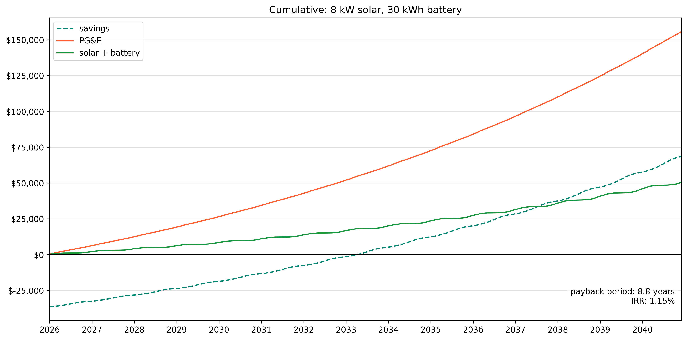

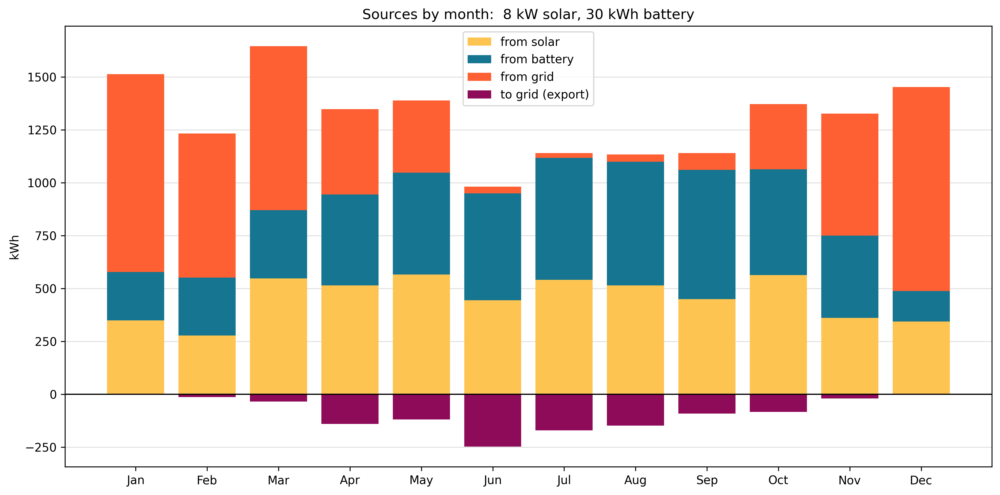

### by month

### January
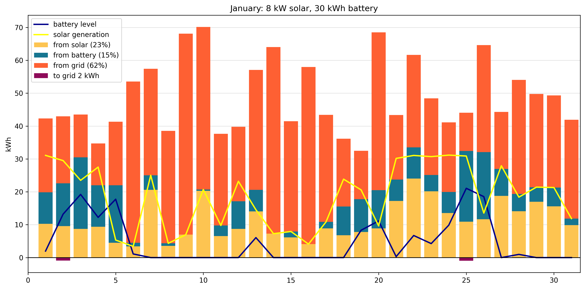

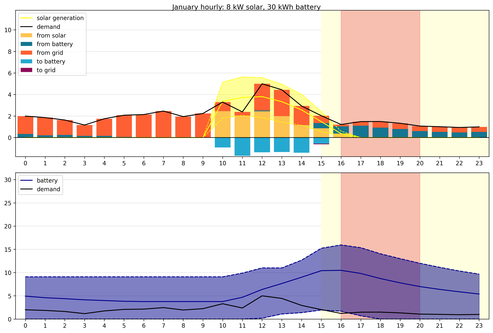

### July
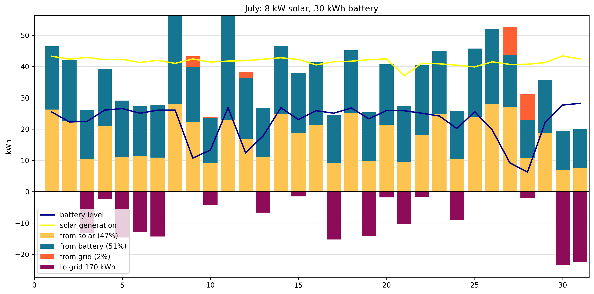

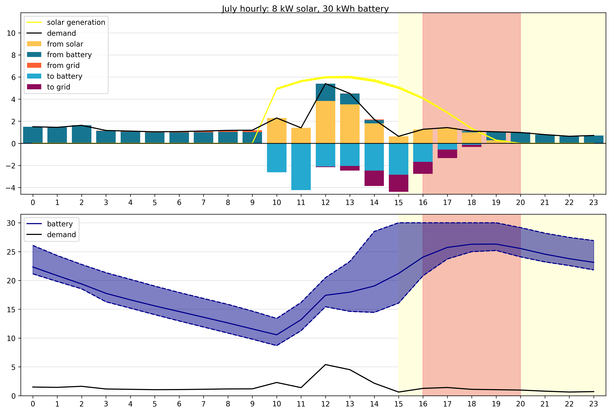

### October

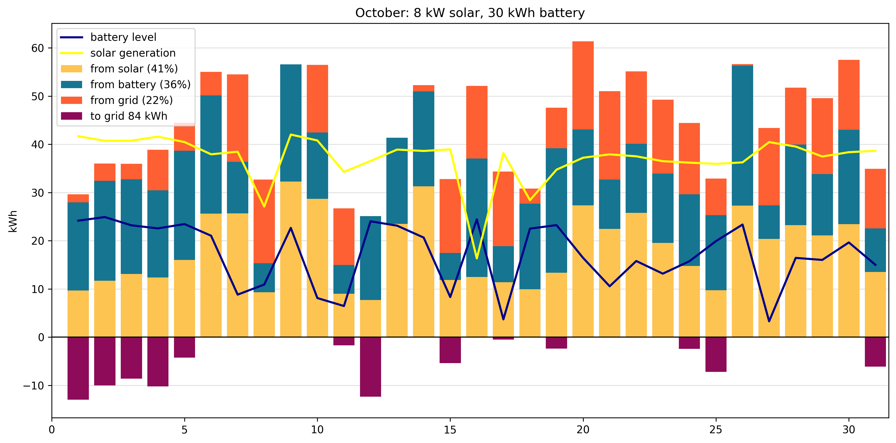

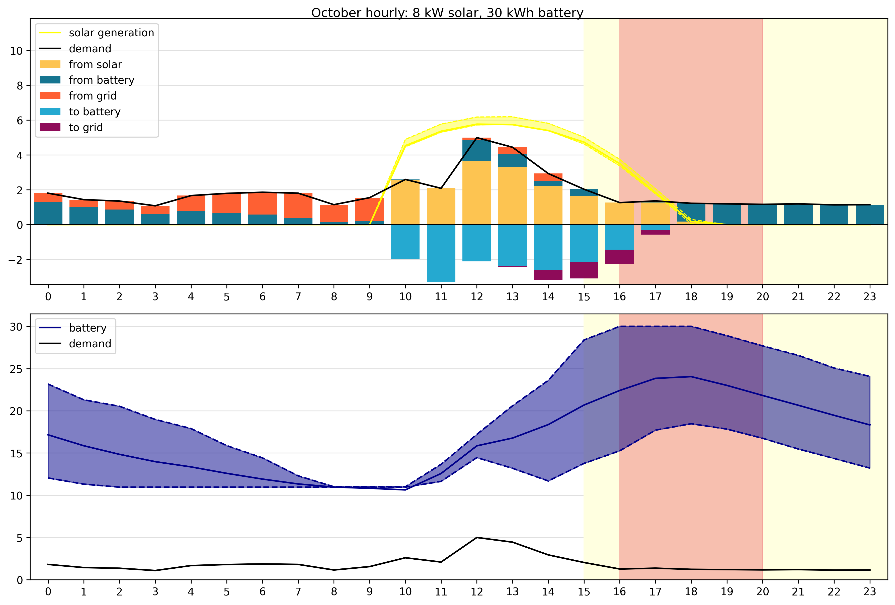

## Year 2 results

|  |  |
|--------|-------:|
| Grid cost | $5,632 |
| Net cost | $1,581 | 
| Savings | $4,052 |
| From grid | 4,237 kWh |
| From grid % | 27% |
| To grid | 1,048 kWh |
| Credit per kWh | $0.08 |
| Applied credit per kWh | $0.08 |

### Credits

| Credit type | Applied | Rollover (unused) |
|--------|-------:|-------:|
| Generation | $49 | $-0 |
| Delivery credit | $39 | $0 |
| Bonus | $41 | $0 |

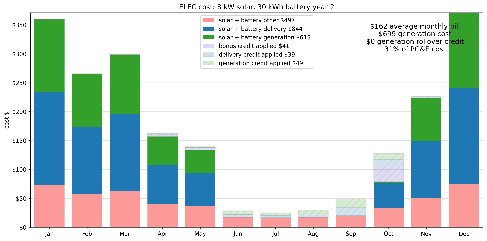

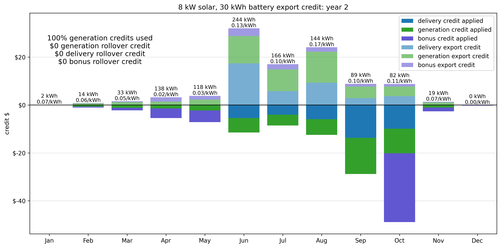

## Year 5 results

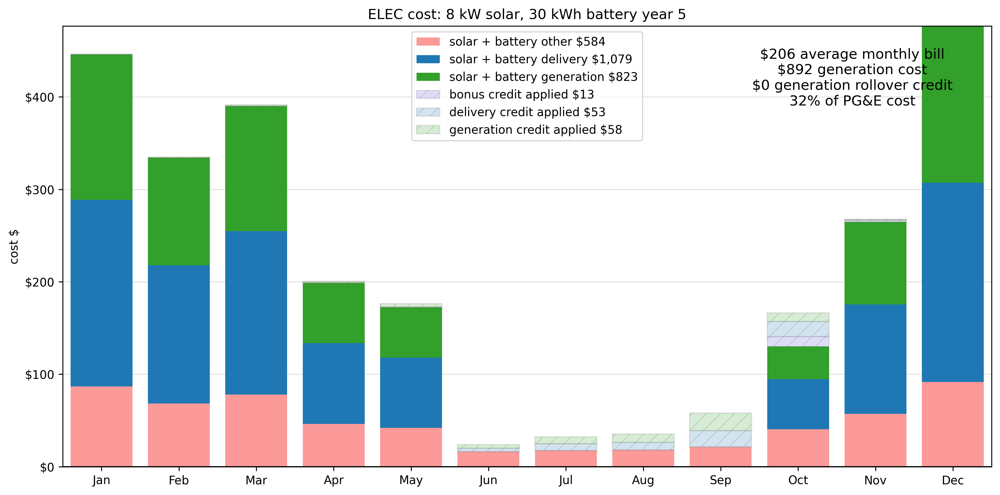

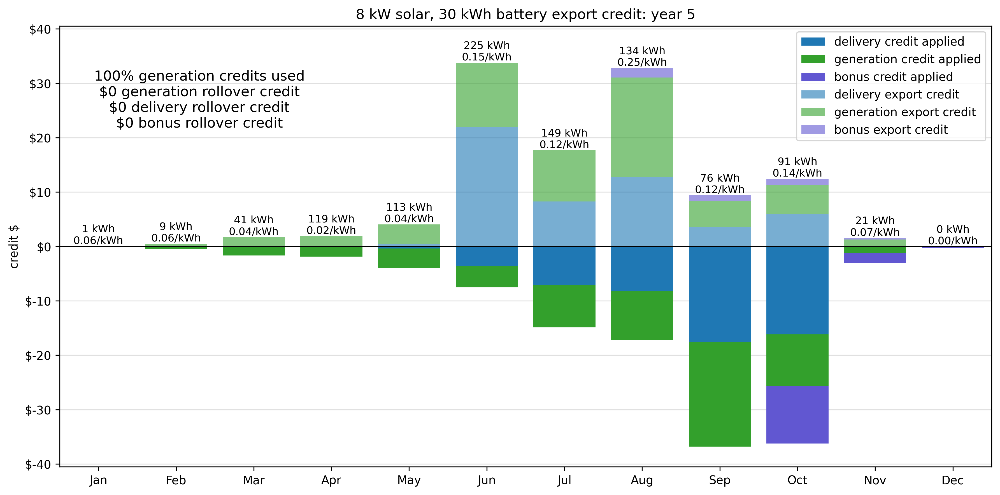